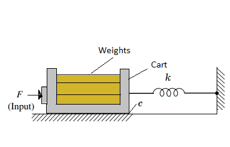

## Introduction

<b>Discipline | <b> Electrical Engineering 
:--|:--|
<b> Lab | <b> **Control and Instrumentation Lab**
<b> Experiment|     <b> **Study of Rectilinear Motion and Experiment 1**

### About the Experiment 
**System description**

Rectilinear motion is another name for straight-line motion. This type of motion describes the movement of a particle or a body. The experimental control system in practical laboratory is comprised of the electromechanical plant which consists of the spring/mass mechanism, its actuator, sensors and a subsystem 
i.e. an operating program or software which runs on a PC . This experiment use (encoder) counts as the system units of position, where the counts correspond to the encoder pulses and controller-internal register values.
								
								

<b>Figure 1: Schematic representation of the Rectilinear Motion setup in Control Systems </b>

<b>Name of Developer | <b> **Prof. Alok Kanti Deb**
:--|:--|
<b> Institute | <b>  **Indian Institute of Technology Kharagpur**
<b> Email id|     <b>  **alokkanti@ee.iitkgp.ac.in**
<b> Department |  **Department of Electrical Engineering**
<b>Webpage| <b> http://www.iitkgp.ac.in/department/EE/faculty/ee-alokkanti

### Contributors List

SrNo | Name | VLabs Developer or Integration Engineer | Designation | Department| Institute
:--|:--|:--|:--|:--|:--|
1 | **Piyali Chattopadhyay** | Developer & Integration | Project Scientist | Department of Electrical Engineering | IIT Kharagpur | 
