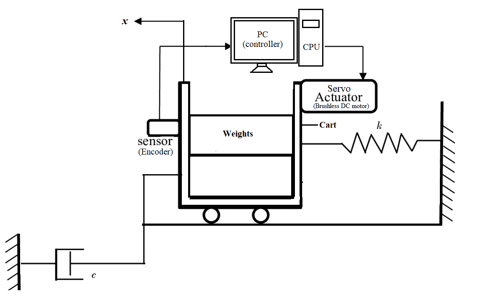
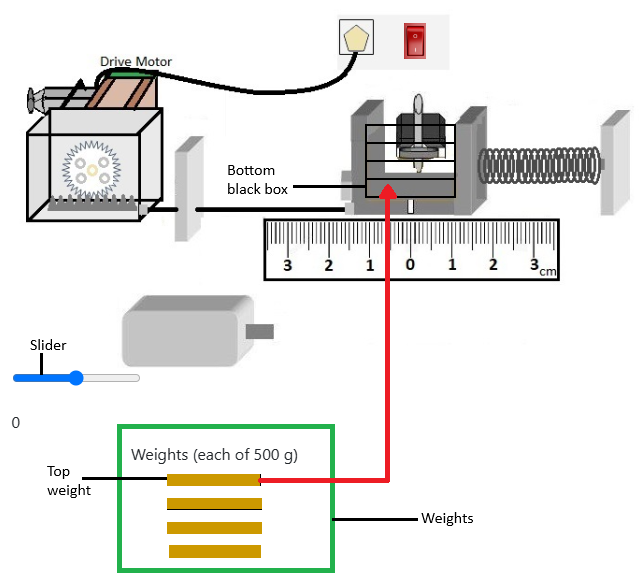
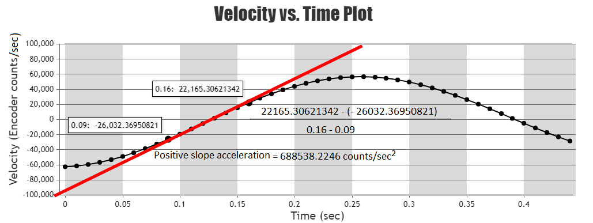

### Procedure

**Plant Setup**
								

 
<b>Fig. 1. Schematic diagram of rectilinear motion control plant</b>

								
								
**Steps to perform the simulation**
								
<ol type="1">

<li><ul><li>First drag weights and drop them sequentially (move the top weight to the bottom black box on the cart and do the same for the second weight by placing it in the second lowest box.) in the mass carriage system.</li> 
<li>Each weight is 500 g. First drag all the weights (i.e. 2 kg mass).</li></ul></li>

 
<b>Fig. 2. Weights placing in simulation page</b>

 

<li> <ul><li>Switch on the power supply by clicking on the red switch.</li>
<li>Under 'Controls' section click on 'Trajectory' under command tab, then click on 'Step'.</li>
<li>After that click on 'Setup', put 'Step Size' to zero, set 'Dwell Time' to 3000 ms and 1 repetition in 'Number of reps' input field. Select 'Open loop step' and 'Ok'.</li></li></ul>

 
<b>Fig. 3. 'Controls' section in simulation page</b>

 

<li> Click on "Setup Data Acquisition" under 'Data' tab, put 2 as the value of servo cycles and select 'Encoder Position'.</li> 

<li>Drag the mass carriage system through the slider (kept below the Mass Spring Damper plant) up to -2.5 cm. </li>  

<li>Click on 'Execute' under 'Command', then click on 'RUN' button. The system starts to oscillate.</li> 

<li>After the carriage stops oscillating, an alert massage will be shown. Click on 'Ok'.</li> 

<li>Click on 'Setup Plot' under 'Plotting'. Select 'Encoder Position' and click on 'Ok'.</li>     

<li> Click on 'Plot Data' under 'Plotting' ,the open loop step response for the particular mass chosen, will be shown. Plot can be
downloaded by clicking on 'Download Plot' button.</li> 

<li>Click on 'Reset Controller' under 'Utility' tab. Now to observe the response for unloaded mass choose no weights and follow the steps 2-8.</li> 

<li>Under 'Calculation' tab select 'Without Damper', enter both the mass values chosen 
(ex. here the first mass was 2 kg and second one is 0 kg) and click on 'Simulate' to have the values of <i style="font-family:bodoni MT;">Mc</i> (mass of the carriage) and 
<i style ="font-family:'Bodoni MT';font-size:20px;">k</i> (spring constant).</li> 

<li>Now click on 'Connect Dashpot' button to connect the dashpot to the mass carriage system.</li> 

<li>Similarly drag 2 kg weight again and follow the above steps 2-8 to observe open loop step response of the mass carriage system with connected dashpot.
In this case 'Encoder Position' will be default selection in step 3.							
</li> 

<li>Under 'Calculation' tab select 'With Damper', enter the mass value chosen (ex. here the mass was 2 kg)
and click on 'Simulate' to have the value of <i style ="font-family:'Bodoni MT';font-size:20px;">c</i> (dashpot damping coefficient).</li> 

<li> To observe system velocity first remove dashpot from the mass carriage system by clicking on 'Remove Dashpot' button. Now secure 2 kg mass in the carriage.</li> 

<li>Follow steps 2-8 with some following edits. 
i) In step 2 set 'Step Size' to 2, 'Dwell Time' to 75 ms and repetition 3.  
ii)In step 3 select 'Encoder Velocity'. 
iii)In step 7 Select 'Encoder Velocity' and click on 'Ok'.  

<li><ul><li>To calculate acceleration first assume a positive-sloped linear segment (two points on positive slope forming straight line) from velocity vs. time plot.</li>
<li>Align the slope line (red coloured line) with the assumed linear segment using 'Adjust slope angle', 'Adjust slope length', 'Horizontal movement' and 'Vertical movement'
buttons.</li></li></ul> 

 
<b>Fig. 4. Calculation of positive slope acceleration</b>

 

<li><ul><li>Click on clockwise arrow symbol on 'Adjust slope angle' button to rotate the slope line in clockwise direction.</li>
<li>Click on counter-clockwise arrow symbol on 'Adjust slope angle' button to rotate the slope line in anti clockwise direction.</li>

<li>Click on plus symbol on 'Adjust slope length' button to increase the length of the slope line.</li>
<li>Click on minus symbol on 'Adjust slope length' button to decrease the length of the slope line.</li>

<li>Click on the arrow symbol in the left side on 'Horizontal movement' button to move the slope line to the right.</li>
<li>Click on the arrow symbol in the right side on 'Horizontal movement' button to move the slope line to the left.</li>

<li>Click on the arrow symbol in the left side on 'Vertical movement' button to move the slope line to the upwards direction.</li>
<li>Click on the arrow symbol in the right side on 'Vertical movement' button to move the slope line to the downwards direction.</li></ul>							

</li> 

<li>From those point coordinates calculate positive slope acceleration using formula (velocity difference/ time difference) (explained in Fig. 4).
</li> 

<li>Similarly follow steps 16-18 to calculate negative slope acceleration from an assumed negative-sloped linear segment in velocity vs. time plot.</li> 

<li> Under 'Calculation' tab select 'Gain Calculation'. Enter the acceleration values from positive slope and negative slope of velocity vs. time plot. Click on 'Simulate' button.</li> 

<li>Switch off the power supply by clicking on the red switch.</li> 

</ol>
 					
  
