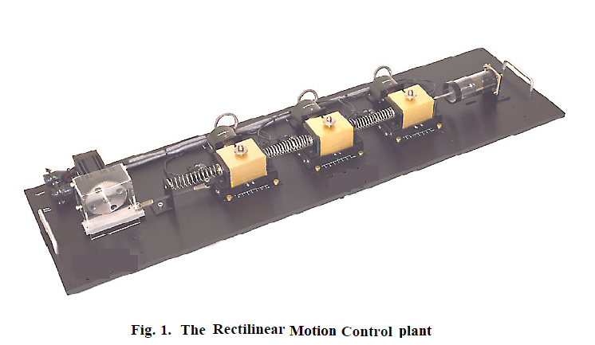

### Procedure
 

								<h2>Set up in Lab:</h2>
								

 
								

 								
								
[Fig 2: Circuit diagram of experimental set-up for Rectilinear Motion Control simulation]
 
								 
								
<b>Steps to perform the simuation</b> 
								<ol type="1">
  <li>Drag weights(brown coloured boxes)and drop them in the white line boxes in the mass carriage system(for ex. Drag the uppermost weight and put it in the lowermost white box).Each of the weights are of 500g.First drag all the weights (i.e. select 2kg mass).</li> 
  
  <li>Click on 'Trajectory' from command tab under 'Controls',then click on step.After that click on 'Setup', put step size to zero,set dwell time to 3000 ms and 1 repeatation .Select 'Open loop step' and 'Ok' to observe open loop step response for 2kg mass.</li> 
 
 <li> Click on "Setup Data Aquisition" under 'Data' tab, put 2 as the value of servo cycles .</li> 

  <li>Drag the mass carriage system through the slider upto -2.5cm. </li>  

<li>Click on 'Execute' under 'command',then click on 'RUN' button.The system starts to oscillate.</li> 

<li>After the carriage stops oscillating,an alert massage will be shown.Click on 'Ok'.</li> 

<li>Click on 'Set up Plot' under 'Plotting'. Select 'Encoder Position' and click 'ok'</li>     

<li> Click on 'Plot data' under 'Plotting' ,the 'Open loop step' response for the particuler mass chosen will be shown.</li> 
 
<li>Click on 'Reset Controller' under 'Utility' tab to observe response for unloaded mass choosing no weights and following the above steps.</li> 
<li>Under 'Calculation' tab select 'Without Damper',enter both the mass values chosen(for ex. here the first mass was 2kg and second one is 0kg) and click on 'Simulate' to have the values of Mc(weight of the carriage) and K(spring constant).</li> 

 <li>Now click on 'Connect Dashpot' button to connect the dashpot to our mass carriage system.</li> 
 
 <li>Similerly drag 2kg weight again and follow the above steps to observe open loop step response of the mass carriage system with connected dashpot.</li> 
 
 <li>Under 'Calculation' tab select 'With Damper',enter the mass value chosen(for ex. here the mass was 2kg) and click on 'Simulate' to have the value of C(Dashpot damping coefficient).</li> 
 
 <li> To observe system velocity first remove dashpot from the mass carriage system by clicking on 'remove dashpot' button. Now secure 2kg mass in the carriage.</li> 
 
 <li>Steps will be same, as said before with some following edits. In step 2 set dwell Time to 75 ms and repeatation 2 and in step 4 Drag the mass carriage system through the slider upto -3cm.   </li>
  
 <li>In step 7 Select 'Encoder Velocity' and click 'ok'</li> 
 
 <li>Calculate acceleration (for both positive & negative slope) using formula (velocity difference/ time difference).</li> 
 
 <li> Under 'Calculation'tab select 'Gain Calculation'.Enter the acceleration values from positive slope and negative slope of velocity vs. time plot. Click on 'Simulate'.
 
  </ol>		    
								

							
                     