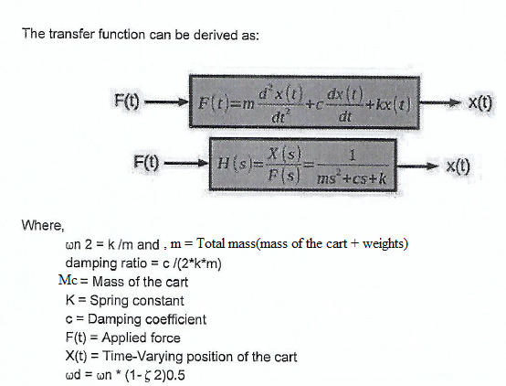

### Theory

								<b>Rectilinear Motion:</b>
                           Rectilinear motion is another name for straight-line motion. This type of motion describes the movement of a particle or a body.
                           A body is said to experience rectilinear motion if any two particles of the body travel the same distance along two parallel straight lines.
						   The figures below illustrate rectilinear motion for a body. 
							 
							Rectilinear Motion for a body.								
								The experimental control system in practical laboratory is comprised of the electromechanical plant which consists of the spring/mass mechanism, its actuator and sensors and a subsystem 
								i.e. the executive program which runs on a PC under the DOS or Windows operating system.&nbsp;
								This experiment use (encoder) Counts as the system units of position.The Counts option, for example, is most useful when the course incorporates elements of 
								the hardware and data processing implementation where the counts correspond to encoder pulses and controller-internal register values. 					
								here, 1 encoder revolution = 16,000 encoder counts 
                                                            = 7.06 cm.								
								 
								<h2>Rectilinear Motion set up in Control Systems:</h2>
								 
								 
								open loop step plot for 1kg mass on Mass Spring Damper system without connecting the dashpot 
								 
								
The so-called hardware gain, khw,  of the system is comprised of the product: khw = kc ka kt kmp ke kep ks  
								where the theoritical values are: 
	                             kc, the DAC gain, = 10V / 32,768 DAC counts 
                                  ka, the Servo Amp gain, = approx 2 (amp/V) 
								  kt, the Servo Motor Torque constant =  approx 0.1 (N-m/amp) 
                                  kmp, the Motor Pinion pitch radius inverse = 26.25 m-1 .
                                  ke, the Encoder gain, = 16,000 pulses / 2&#960; radians 
                                  kep, the Encoder Pinion pitch radius inverse = 89 m-1 
                                  ks, the Controller Software gain, = 32 
								  Hence the theoritical value of hardware gain comes approximately (11.61 &#215; 10&#179;)			  
								  

		
    