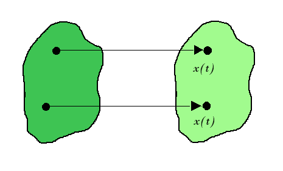
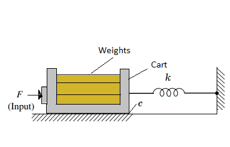
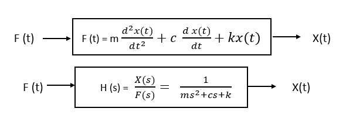
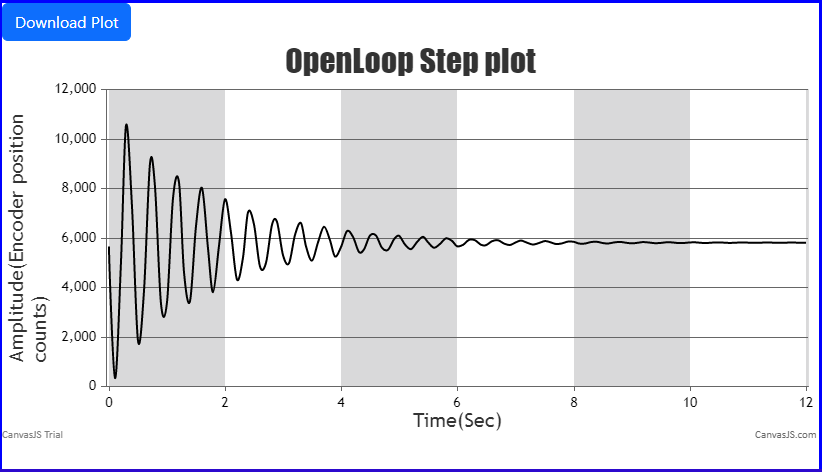

# Theory

 **Rectilinear Motion:**
				  
Rectilinear motion is another name of straight-line motion. This type of motion describes the movement of a particle or a body. A body is said to experience rectilinear motion if any two particles of the body travel the same distance along two parallel straight lines. The figures below illustrate rectilinear motion for a body.
						   

							
The experimental control system in practical laboratory is comprised of the electromechanical plant which consists of the spring/mass mechanism, its actuator and sensors and a subsystem i.e. an operating program or software which runs on a PC . This experiment use (encoder) counts as the system units of position, where the counts correspond to the encoder pulses and controller-internal register values.
								
Here, 1 encoder revolution = 16,000 encoder counts = 7.06 cm.
                                                            
**Rectilinear Motion setup in Control Systems:**

								

								
$$\omega_n^{2} = \frac{k}{m}$$
								
$$\zeta (damping \ ratio) = \frac{c}{2 k m}$$
								
$$\omega_d = \omega_n \sqrt{(1 - \zeta^{2})}$$
								
Where,
								
m = Total mass ( mass of the cart + weights)

Mc = Mass of the cart

k = Spring constant

c = Damping coefficient

F(t) = Applied force

X(t) = Time-Varying position of the cart

&omega;n = Natural frequency of the system

&omega;d = Damped natural frequency of the system
								
								
Open loop step plot for 1kg mass on Mass Spring Damper system without connecting the dashpot:
								

								
The hardware gain, khw,  of the system is comprised of the product: khw = kc ka kt kmp ke kep <!--ks--> 

where the theoretical values are:

kc, the DAC gain, = 10V / 32,768 DAC counts

ka, the Servo Amp gain, = approx 2 (amp/V)

kt, the Servo Motor Torque constant =  approx 0.1 (N-m/amp)

kmp, the Motor Pinion pitch radius inverse = 26.25 m-1

ke, the Encoder gain, = 16,000 pulses / 2&#960; radians

kep, the Encoder Pinion pitch radius inverse = 89 m-1
                              

						
								