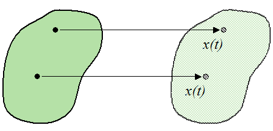
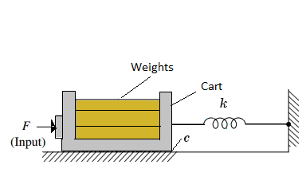
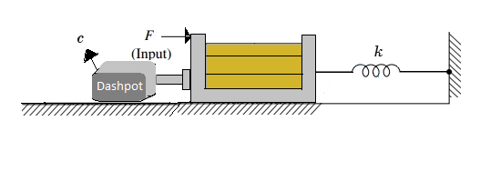
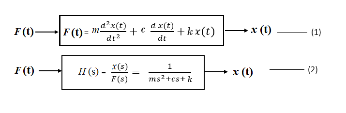
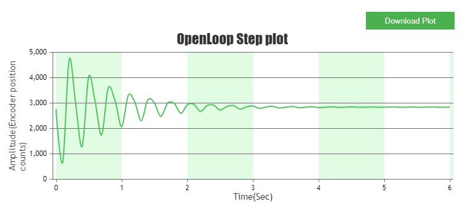
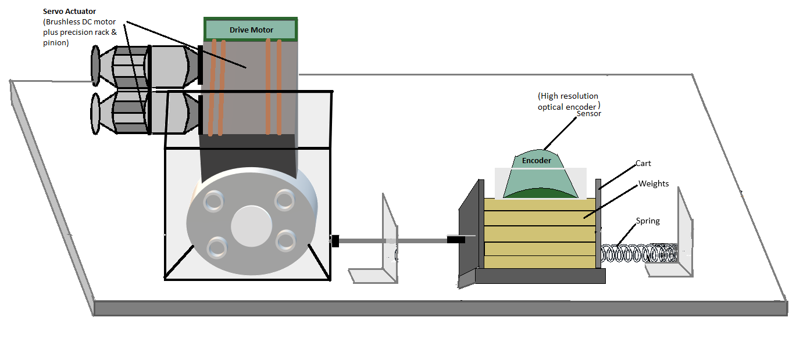
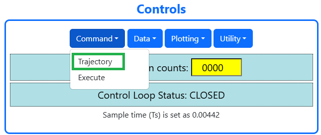

# Theory

 **Rectilinear Motion**
				  
Rectilinear motion is another name of straight-line motion. This type of motion describes the movement of a particle or a body.
A body is said to experience rectilinear motion if any two particles of the body travel the same distance along two parallel straight lines.
The fig 1 illustrates rectilinear motion for a body. 

 

<b>Fig. 1. Rectilinear Motion</b>

 

The experimental control system in practical laboratory is comprised of the electromechanical plant which consists of the spring-mass mechanism, its actuator and sensors and a subsystem 
i.e. an operating program or software which runs on a PC .  

<b>Encoder</b> 

An encoder is a sensor that converts a positional output into an electronic signal. In this experiment, encoder counts are used as the system units of position, where the counts correspond to the encoder pulses and controller-internal register values. Here, 1 encoder revolution is equivalent to 16,000 encoder counts, which corresponds to 7.06 cm.
  

<h2>Rectilinear Motion Setup in Control Systems</h2>

 
<b>Fig. 2. Rectilinear Motion Setup without dashpot connected</b>

 

 
<b>Fig. 3. Rectilinear Motion Setup with dashpot connected</b>

 

Re arranging the equation (2) and comparing the denominator terms with the characteristics equation of a
second order control system we get,

$$s^2 + 2 \zeta \omega_n s + \omega_n^2 = s^2 + \frac{c}{m}s + \frac{k}{m} \tag{3}$$

$$\omega_n^{2} = \frac{k}{m} \tag{4}$$

$$\zeta = \frac{c}{2 \sqrt{k m}} \tag{5}$$

$$\omega_d = \omega_n \sqrt{(1 - \zeta^{2})} \tag{6}$$

where, 

<i style ="font-family:'Bodoni MT';font-size:20px;">m</i> = Total mass (mass of the cart + weights) 								
<!--Mc = Mass of the cart -->
<i style ="font-family:'Bodoni MT';font-size:20px;">k</i> = Spring constant 
<i style ="font-family:'Bodoni MT';font-size:20px;">c</i> = Damping coefficient 
&zeta; = Damping ratio 
<i>F</i>(t) = Applied force 
<i>x</i>(t)  = Time varying position of the cart 
<i style ="font-family:'Bodoni MT';font-size:20px;">&omega;n</i> = Natural frequency of oscillations 
<i style ="font-family:'Bodoni MT';font-size:20px;">&omega;d</i> = Damped natural frequency of oscillations  

 
<b>Fig. 4. Open loop step plot for 1 kg mass on Mass Spring Damper system without connecting the dashpot</b>

 

 
<b>Fig. 5. Rectilinear Plant</b>

 

The hardware gain, <i style ="font-family:'Bodoni MT';font-size:20px;">khw</i>,  of the system is comprised of the product

$$k_{hw} = k_c \ k_a \ k_t \ k_{mp} \ k_e \ k_{ep} \tag{7}$$

where the theoretical values are 
<i style ="font-family:'Bodoni MT';font-size:20px;">kc</i>, the DAC gain, = 10V / 32,768 DAC counts 
<i style ="font-family:'Bodoni MT';font-size:20px;">ka</i>, the Servo Amp gain, = approx 2 (amp/V) 
<i style ="font-family:'Bodoni MT';font-size:20px;">kt</i>, the Servo Motor Torque constant =  approx 0.1 (N-m/amp) 
<i style ="font-family:'Bodoni MT';font-size:20px;">kmp</i>, the Motor Pinion pitch radius inverse = 26.25 m-1 
<i style ="font-family:'Bodoni MT';font-size:20px;">ke</i>, the Encoder gain, = 16,000 pulses / 2&#960; radians 
<i style ="font-family:'Bodoni MT';font-size:20px;">kep</i>, the Encoder Pinion pitch radius inverse = 89 m-1 
<!--ks, the Controller Software gain, = 32--> 

 

<b>Controls section description:</b> 

 
<b>Fig. 6. Conrols Section in simulation page</b>

 

This experiment needs support of PC controller which is shown in the 'Simulation' as 'Controls' section. This section contains some tabs named 'Command', 'Data', 'Plotting'
and 'Utility'. 
<ol>
<li><b>Command :</b> The Command menu contains two pull-down options i.e. 'Trajectory' and 'Execute'.
<ul><li>The Trajectory Configuration dialog box provides a selection of	trajectory through which the apparatus can be maneuvered. Here it is 'Step'.</li>
<li>After selecting the step trajectory followed by Setup, one enters a dialog box for the corresponding trajectory.</li> 
<li>Here 'Open loop step' needs to be selected.</li>
<li>After clicking the 'Execute' option one dialog box is appeared. Here the user commands the system to execute the current specified trajectory.</li>
<li>The user normally selects 'Run' here. The controller will begin execution of the specified trajectory.</li>
<li>Once finished the data will be uploaded into the PC memory for plotting and saving.</li></ul></li> 

<li><b>Data:</b> The Data menu contains one pull-down option i.e. Setup Data Acquisition.
<ul><li>An encoder is a sensor that converts a positional output into an electronic signal.</li>
<li>In this experiment, encoder counts are used as the system units of position to follow the specified trajectory.</li>
<li>In 'Setup Data Acquisition' dialog box user needs to select suitable option based on the instruction provided.</li>
<li>The user must also select sampling period in multiples of the servo cycle. For example, the sample time Ts is 0.00442 seconds and 5 for your gather period here, then the selected data will be gathered 
once every fifth sample or once every 0.0221 seconds.</li></ul></li> 

<li><b>Plotting:</b> The 'Plotting' segment has two two pull-down options i.e. 'Setup Plot' and 'Plot Data'.
<ul><li>Same like 'Setup Data Acquisition' dialog box user needs to select suitable option based on the instruction provided.</li>
<li>The Setup Plot dialog box allows the acquired data to be plotted.</li>
<li>The 'Plot Data' will provide response to the user or generates a plot of the selected item.</li></ul></li> 

<li><b>Utility:</b> The 'Utility' has one pull-down option i.e. 'Reset Controller' which enables the user to redo the experiment with different value of weights.</li></ol> 

								
