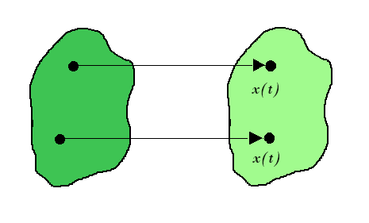
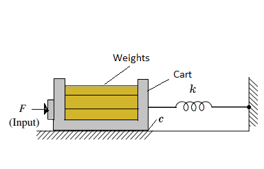
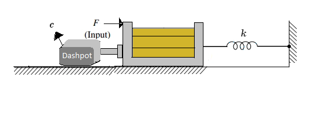
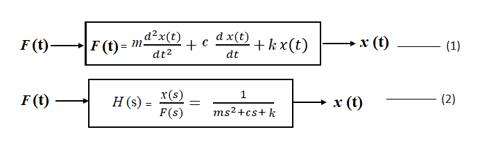

# Theory

 **Rectilinear Motion:**
				  
Rectilinear motion is another name of straight-line motion. This type of motion describes the movement of a particle or a body.
A body is said to experience rectilinear motion if any two particles of the body travel the same distance along two parallel straight lines.
The fig 1 illustrates rectilinear motion for a body.
						   

	
<b>Fig 1: Rectilinear Motion</b>

							
The experimental control system in practical laboratory is comprised of the electromechanical plant which consists of the spring-mass mechanism, its actuator and sensors and a subsystem 
i.e. an operating program or software which runs on a PC.

<b>Encoder:</b>

An encoder is a sensor that converts a positional output into an electronic signal. In this experiment, encoder counts are used as the system units of position, where the counts correspond to the encoder pulses and controller-internal register values. Here, 1 encoder revolution is equivalent to 16,000 encoder counts, which corresponds to 7.06 cm.
								
                                                            
**Rectilinear Motion Setup in Control Systems:**

	
<b>Fig 2: Rectilinear Motion Setup without dashpot connected</b>

 
	
<b>Fig 3: Rectilinear Motion Setup with dashpot connected</b>

Re arranging the equation (2) and comparing the denominator terms with the characteristics equation of a second order control system we get,

$$s^2 + 2 \zeta \omega_n s + \omega_n^2 = s^2 + \frac{c}{m}s + \frac{k}{m}$$
								
$$\omega_n^{2} = \frac{k}{m}$$

$$\zeta (damping \ ratio) = \frac{c}{2 \sqrt{k m}}$$

$$\omega_d = \omega_n \sqrt{(1 - \zeta^{2})}$$
								
Where,
								
<i style ="font-family:'Bodoni MT';font-size:20px;">m</i> = Total mass (mass of the cart + weights)								

<i style ="font-family:'Bodoni MT';font-size:20px;">k</i> = Spring constant

<i style ="font-family:'Bodoni MT';font-size:20px;">c</i> = Damping coefficient

<i>F</i>(t) = Applied force

<i>x</i>(t)  = Time varying position of the cart

<i style ="font-family:'Bodoni MT';font-size:20px;">&omega;n</i> = Natural frequency of oscillations

<i style ="font-family:'Bodoni MT';font-size:20px;">&omega;d</i> = Damped natural frequency of oscillations

	

	
<b>Fig 4: Open loop step plot for 1 kg mass on Mass Spring Damper system without connecting the dashpot</b>

	
<b>Fig 5: Rectilinear Plant</b>

								
The hardware gain, <i style ="font-family:'Bodoni MT';font-size:20px;">khw</i>,  of the system is comprised of the product: <i style ="font-family:'Bodoni MT';font-size:20px;">khw = kc ka kt kmp ke kep</i> 

where the theoretical values are:

<i style ="font-family:'Bodoni MT';font-size:20px;">kc</i>, the DAC gain, = 10V / 32,768 DAC counts

<i style ="font-family:'Bodoni MT';font-size:20px;">ka</i>, the Servo Amp gain, = approx 2 (amp/V)

<i style ="font-family:'Bodoni MT';font-size:20px;">kt</i>, the Servo Motor Torque constant =  approx 0.1 (N-m/amp)

<i style ="font-family:'Bodoni MT';font-size:20px;">kmp</i>, the Motor Pinion pitch radius inverse = 26.25 m-1

<i style ="font-family:'Bodoni MT';font-size:20px;">ke</i>, the Encoder gain, = 16,000 pulses / 2&#960; radians

<i style ="font-family:'Bodoni MT';font-size:20px;">kep</i>, the Encoder Pinion pitch radius inverse = 89 m-1

						
								
